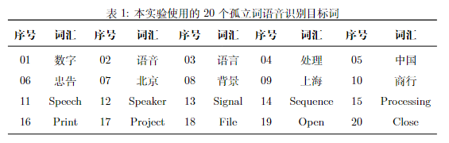
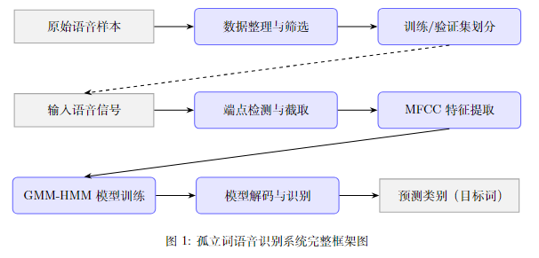
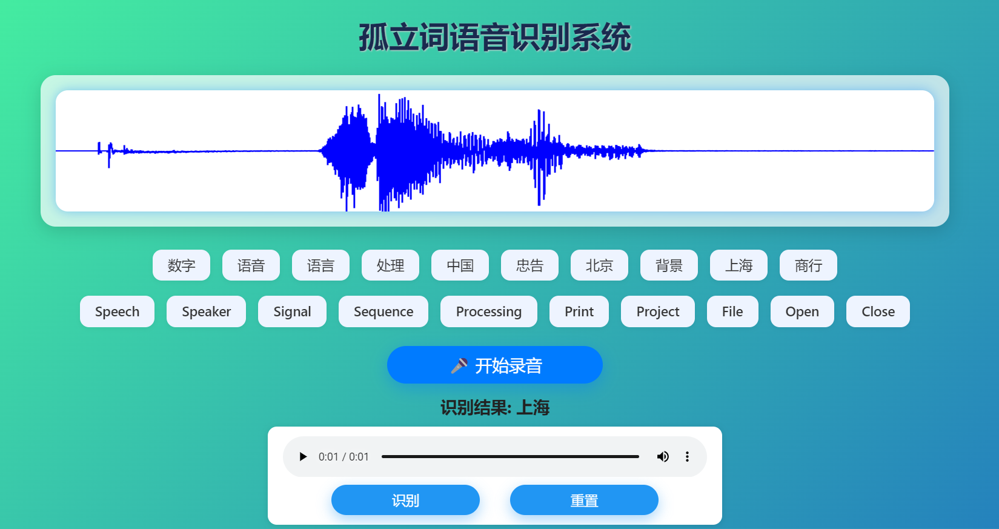

# 基于 GMM-HMM 的孤立词语音识别系统

本项目实现了一个面向孤立词语音识别任务的系统，目标是对预定义的孤立词进行准确识别。孤立词识别是指识别在固定时间段内单独发音的词语，不涉及连续语音中的上下文信息。


本系统支持以下20个孤立词的语音识别：
<div align=center>  
 
</div>

## 功能特性

- 数据预处理：包括数据整理与筛选、端点检测、MFCC 特征提取。
- 语音识别模型设计：采用 GMM-HMM 声学模型架构，包括隐马尔可夫模型（HMM）和高斯混合模型（GMM）。
- 实验结果与分析：对不同说话人的识别准确率进行评估，并分析低准确率样本的识别错误。

## 系统框架图

<div align=center>  
 
</div>

## 快速开始

1. **环境准备(Python 3.x)**
```bash
pip install numpy scipy librosa hmmlearn flask flask-cors pyaudio scikit-learn
```

2. **启动 Flask 应用**：
   在项目的根目录下运行以下命令启动 Flask 应用：

```bash
python app.py
```

3. **访问应用**：
打开浏览器并访问 `http://127.0.0.1:5000`，您应该能看到应用的前端界面。
   <div align=center>  
     
    </div>

4. **录制音频**：
点击“开始录音”按钮并说话，录音结束后点击“识别”按钮。

5. **查看识别结果**：
识别结果将显示在页面的“识别结果”区域。
